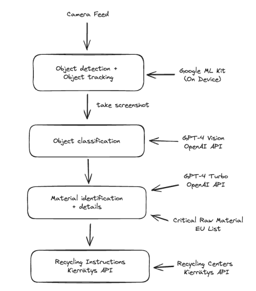

<h1 align="center">ReMaskIt</h1>

<div align="center" >

[](http://junction2023.url.com)

## </div>

<h2 align="center"> 
Raising Awareness, Educating, and Motivating for Sustainable Recycling
</h2>

## 🧐 Problem Statement <a name = "problem_statement"></a>

A significant percentage of critical raw materials, including Lithium, are not recycled due to a lack of awareness and correct recycling practices. This not only harms the environment but also poses a threat to supply chains and sustainability. Our solution aims to address this issue by creating an innovative Instagram filter that combines awareness, education, and motivation to encourage sustainable recycling.

## 💡 Idea / Solution <a name = "idea"></a>

Using the power of Instagram, we deploy our solution as a filter that users can share as Instagram stories or reels. The filter employs cutting-edge object detection and classification technology, including OpenAI GPT-4 Vision and GPT-4 Turbo, to provide users with insights into the impact of recycling. It also guides them to the nearest recycling stations. To motivate users, we offer point rewards that can be redeemed as perks from partner companies. These companies, in turn, support our initiative by advertising through content generated by our filter.

[](https://www.youtube.com/watch?v=VVhAUjZ5tLs)

## 🏁 Getting Started <a name = "getting_started"></a>

### Frontend

1. Navigate to the frontend folder

```bash
cd frontend
```

2. Install dependencies

```bash
yarn
```

3. Start React Native app

```bash
npm run ios
```

### Backend

1. Navigate to the backend folder

```bash
cd backend
```

2. Install Flask dependencies

```bash
pip install -r requirements.txt
```

3. Run Flask server

```bash
python app.py
```

### Machine Learning & Data Pipeline



## ⛓️ Built With <a name = "tech_stack"></a>

- **Frontend**
  - [React Native](https://reactnative.dev/)
- **Backend**
  - [Flask](https://flask.palletsprojects.com/)
- **Machine Learning**
  - [Google MLKit](https://developers.google.com/ml-kit)
  - [OpenAI GPT-4 Vision](https://beta.openai.com/docs/)
  - [OpenAI GPT-4 Turbo](https://beta.openai.com/docs/)
- **Data Source**
  - [Kierrätys API](https://www.kierratys.info/)

## ✍️ Team & Credits <a name = "team_credits"></a>

- Daria Kazmina: Pitch, Market Research
- Hussain Pettiwala: Frontend, API Integration
- Jay Malve: Backend, Prompt Engineering
- Imed-Eddine Haouli: Machine Learning PhD
- Simon Farshid: Pitch, On-Device Object Detection

## 🎉 Acknowledgments <a name = "acknowledgments"></a>

- Hat tip to anyone whose code or tools were used
